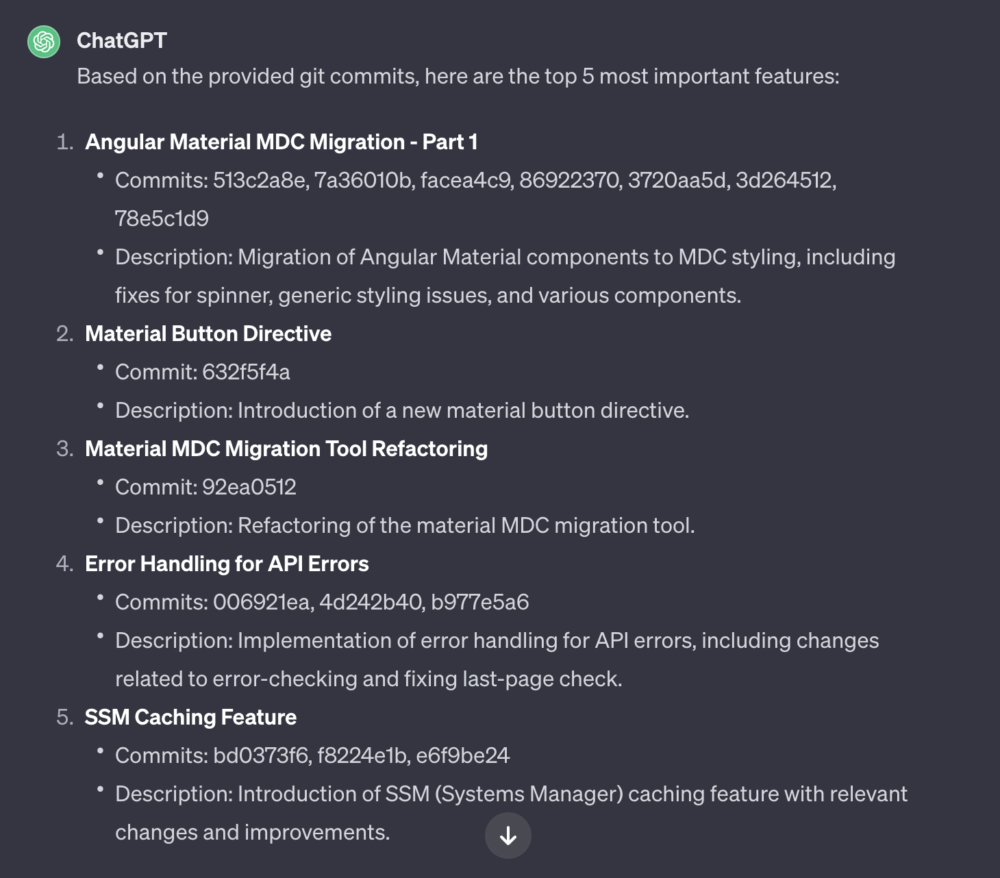

# Summarize git log output 

Tool to automate the git log command and prompt summarization of the output, used to create a weekly summary of the git contributions of a team.

## Based on example within the openai gui

## How to
1. put you api key in .env
2. source .env
3. make sure you can run the file:
    - add path source or cp to /usr/local/bin
    - chmod +x /usr/local/bin/yourfile
4. run the file: `$ summarize 7` for summarizing the commits of the last 7 days

## Hints
### git log variations
git log allows different formats, see [git log](https://git-scm.com/docs/git-log) for more information.  
e.g. `git log --merges` for only merge requests or `git log --pretty=medium` for a more detailed output

### prompt engineering
Play and adapt the prompt to fit with how your team writes commit titles and messages